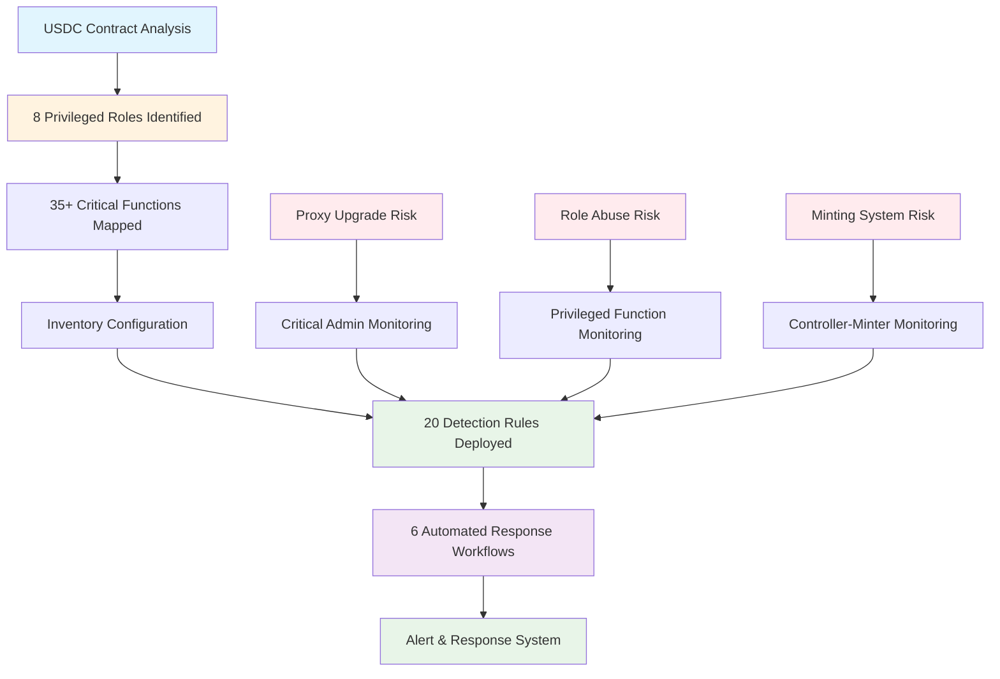

# Blockaid Security Monitoring Setup for USDC Smart Contract

## Executive Summary

This document provides a comprehensive security monitoring solution for the USDC smart contract at `0xa0b86991c6218b36c1d19d4a2e9eb0ce3606eb48`, directly addressing Circle's key security concerns:

- **Privileged access** (who can do what)
- **Proxy implementation upgrade risks**
- **Potential for abuse of admin or role-based functions**

## Security Analysis Results

### **Critical Findings**

Our analysis of the USDC smart contract reveals a sophisticated multi-role architecture with **8 distinct privileged roles** controlling **35+ critical functions**. The contract implements an upgradeable proxy pattern with significant security implications.

#### **Key Risk Areas Identified:**

1. **Proxy Upgrade Vulnerability** - Admin role can upgrade to malicious implementation
2. **Role Concentration Risk** - Owner role has extensive control over 15+ functions
3. **Minting System Complexity** - 4-tier delegation system (Owner → MasterMinter → Controllers → Minters)
4. **Emergency Function Abuse** - Pauser and Blacklister roles can halt operations

#### **Privileged Roles and Functions Mapping:**

| Role | Functions Controlled | Risk Level |
|------|---------------------|------------|
| **Admin** | `upgradeTo()`, `upgradeToAndCall()`, `changeAdmin()` | **CRITICAL** |
| **Owner** | `transferOwnership()`, `updateMasterMinter()`, `updatePauser()`, `updateBlacklister()`, `updateRescuer()`, `configureController()`, `removeController()`, `setMinterManager()`, `upgrade()`, `withdrawFiatToken()`, `abortUpgrade()`, `tearDown()` | **CRITICAL** |
| **Master Minter** | `configureMinter()`, `removeMinter()` | **HIGH** |
| **Controllers** | `configureMinter()`, `incrementMinterAllowance()`, `decrementMinterAllowance()`, `removeMinter()` | **HIGH** |
| **Minters** | `mint()`, `burn()` | **HIGH** |
| **Pauser** | `pause()`, `unpause()` | **HIGH** |
| **Blacklister** | `blacklist()`, `unBlacklist()` | **HIGH** |
| **Rescuer** | `rescueERC20()` | **MEDIUM** |

*Full analysis: [Contract Analysis](./blockaid_setup_configuration_guide/contract_analysis.md)*

## Security Monitoring Architecture

## Documents Guide

### **Step 1: Contract Analysis Foundation**

**Document**: [Contract Analysis](./blockaid_setup_configuration_guide/contract_analysis.md)

**Purpose**: Comprehensive security analysis of USDC smart contract architecture

**Key Outputs**:

- Complete mapping of 8 privileged roles
- Identification of 35+ critical functions
- Proxy upgrade risk assessment
- Role-based function abuse vectors
- Security recommendations

**Critical Findings**:

- Admin role poses highest risk (proxy upgrade capability)
- Owner role has extensive privileges across 15+ functions
- Complex minting delegation system requires specialized monitoring
- Emergency functions can be abused for operational disruption

---

### **Step 2: Monitoring Infrastructure Setup**

**Document**: [Inventory Configuration](./blockaid_setup_configuration_guide/inventory-configuration.md)

**Purpose**: Establish monitoring infrastructure for USDC contract ecosystem

**Components**:

- Asset onboarding for proxy and implementation contracts
- ABI configuration for function monitoring
- Source code integration for state variable tracking
- Contract labeling and categorization

**Requirements**:

- USDC Proxy Contract: `0xa0b86991c6218b36c1d19d4a2e9eb0ce3606eb48`
- USDC Implementation: `0x43506849d7c04f9138d1a2050bbf3a0c054402dd`
- Complete ABI and source code integration

---

### **Step 3: Detection Rules Deployment**

**Document**: [Detection Rules](./blockaid_setup_configuration_guide/detection-rules.md)

**Purpose**: Implement comprehensive monitoring for all identified security risks

**Coverage**:

- **8 Critical Invariant Rules** - Monitor contract state integrity
- **7 Privileged Function Rules** - Track all role-based operations
- **5 Abuse Pattern Rules** - Detect suspicious activity patterns

**Key Detection Categories**:

#### **Critical Invariant Monitoring**

- Role separation violations
- Proxy implementation unauthorized changes
- Minting allowance boundary violations
- Controller-minter relationship integrity
- Total supply conservation
- Emergency state consistency

#### **Privileged Function Monitoring**

- Admin proxy operations
- Owner role function calls
- Master minter operations
- Large minting operations
- Emergency function usage
- Asset recovery operations

#### **Abuse Pattern Detection**

- Rapid privilege escalation
- Unknown address privilege assignment
- Upgrade-to-drain attack patterns
- Blacklist bypass attempts
- Suspicious minter activity

---

### **Step 4: Automated Alert & Response Workflows**

**Document**: [Workflows](./blockaid_setup_configuration_guide/workflows.md)

**Purpose**: Implement automated alerting and response mechanisms to ensure the client is notified of suspicious activity

**Coverage**:

- **6 Comprehensive Workflows** - Automated response for all detection scenarios
- **11 Action Types** - Complete alerting and response capabilities
- **Multi-channel Notifications** - Slack, email, SMS, webhooks
- **Incident Management** - Automated ticket creation and assignment

**Key Workflow Categories**:

#### **Critical Infrastructure Protection**

- Immediate SMS/email alerts for proxy upgrades
- Emergency multisig notifications
- Automated incident creation (P0 priority)
- Transaction data capture for investigation

#### **Minting Security Response**

- Slack notifications for minting anomalies
- Address labeling and analysis
- Automated transaction scanning
- Historical pattern analysis

#### **Emergency Function Monitoring**

- Compliance team notifications
- Legal team alerts for blacklist operations
- Incident tracking and documentation
- Emergency state validation

#### **Advanced Threat Response**

- Multi-channel emergency alerts
- Automated threat actor labeling
- Comprehensive address analysis
- Emergency pause capabilities

### **Monitoring Capabilities**

- **Real-time Detection**: All 35+ critical functions monitored
- **Proactive Alerts**: 20 detection rules with severity classification
- **Comprehensive Coverage**: All 8 privileged roles under surveillance
- **Pattern Recognition**: Advanced abuse detection algorithms
- **Automated Response**: 6 workflows with 11 action types for complete alerting

## Next Steps

1. **[Begin with Contract Analysis](./blockaid_setup_configuration_guide/contract_analysis.md)** - Understand the complete security landscape
2. **[Set up Inventory Configuration](./blockaid_setup_configuration_guide/inventory-configuration.md)** - Establish monitoring infrastructure  
3. **[Deploy Detection Rules](./blockaid_setup_configuration_guide/detection-rules.md)** - Implement comprehensive monitoring
4. **[Configure Automated Workflows](./blockaid_setup_configuration_guide/workflows.md)** - Set up alerting and response mechanisms

--- 