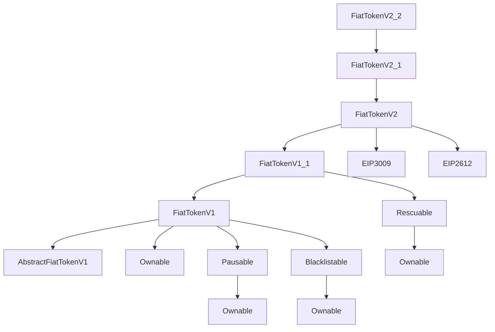

# USDC Smart Contract Security Analysis

## Executive Summary

The USDC (USD Coin) smart contract is a sophisticated, upgradeable ERC-20 token
implementation with multiple privileged roles and advanced access control
mechanisms. This analysis examines the contract structure at address
`0xa0b86991c6218b36c1d19d4a2e9eb0ce3606eb48` to identify security risks and
monitoring requirements.

## Contract Architecture

### Core Components

- **FiatTokenProxy**: Upgradeable proxy contract implementing the OpenZeppelin
  proxy pattern
- **FiatTokenV2_2**: Current implementation contract with ERC-20 functionality
  and additional features
- **AdminUpgradeabilityProxy**: Manages proxy administration and upgrades
- **MasterMinter/MintController**: Manages minting permissions and allowances

### Inheritance Chain



## Privileged Roles Analysis

### 1. **Owner** (`onlyOwner`)

**Description**: Master administrative role with extensive control over contract
configuration, including upgrader contract operations.

**Privileges**:

- Transfer ownership to new address
- Update all other role addresses (except proxy admin)
- Configure/remove controllers in MasterMinter system
- Update MinterManager address
- Emergency rescue functions
- Execute contract upgrades via upgrader contracts
- Withdraw funds from upgrader contracts
- Abort upgrade operations
- Teardown upgrader helper contracts

**Functions**:

- `transferOwnership(address newOwner)`
- `updateMasterMinter(address _newMasterMinter)`
- `updatePauser(address _newPauser)`
- `updateBlacklister(address _newBlacklister)`
- `updateRescuer(address newRescuer)`
- `configureController(address _controller, address _worker)`
- `removeController(address _controller)`
- `setMinterManager(address _newMinterManager)`
- `upgrade()` (V2Upgrader, V2_1Upgrader, V2_2Upgrader)
- `withdrawFiatToken()` (AbstractV2Upgrader)
- `abortUpgrade()` (AbstractV2Upgrader)
- `tearDown()` (AbstractUpgraderHelper)

### 2. **Admin** (`ifAdmin`)

**Description**: Controls proxy-level functionality including contract upgrades.
This is distinct from the `owner` role which controls token-level operations.
The admin role operates at the proxy contract level and manages implementation
upgrades and proxy administration.

**Privileges**:

- Upgrade implementation contract to new versions
- Change proxy admin to new address
- Call initialization functions during upgrades

**Functions**:

- `upgradeTo(address newImplementation)`
- `upgradeToAndCall(address newImplementation, bytes data)`
- `changeAdmin(address newAdmin)`

### 3. **Master Minter** (`onlyMasterMinter`)

**Description**: Controls minter management and allowances. Can be either a
single address or a MasterMinter contract that delegates functionality to
multiple controllers.

**Privileges**:

- Add/remove minters
- Set minting allowances
- Configure minter permissions

**Functions**:

- `configureMinter(address minter, uint256 minterAllowedAmount)`
- `removeMinter(address minter)`

### 4. **Minters** (`onlyMinters`)

**Description**: Authorized addresses that can mint and burn tokens.

**Privileges**:

- Mint new tokens (within allowance)
- Burn own tokens

**Functions**:

- `mint(address _to, uint256 _amount)`
- `burn(uint256 _amount)`

### 5. **Pauser** (`onlyPauser`)

**Description**: Emergency role that can halt all token operations.

**Privileges**:

- Pause/unpause all contract functions
- Stop transfers, minting, and burning during emergencies

**Functions**:

- `pause()`
- `unpause()`

### 6. **Blacklister** (`onlyBlacklister`)

**Description**: Compliance role for regulatory enforcement.

**Privileges**:

- Add/remove addresses from blacklist
- Prevent blacklisted addresses from token operations

**Functions**:

- `blacklist(address _account)`
- `unBlacklist(address _account)`

### 7. **Rescuer** (`onlyRescuer`)

**Description**: Recovery role for trapped ERC-20 tokens.

**Privileges**:

- Rescue accidentally sent ERC-20 tokens
- Transfer trapped tokens to specified address

**Functions**:

- `rescueERC20(IERC20 tokenContract, address to, uint256 amount)`

### 8. **Controllers** (`onlyController`)

**Description**: Delegates of the MasterMinter for operational minting
management. Each controller manages exactly one minter, but a single minter
may be managed by multiple controllers. This enables separation of duties
and simplifies nonce management for operational transactions.

**Architecture**:

- Controllers are assigned by the MasterMinter owner via `configureController()`
- Each controller-minter relationship is one-to-one from controller perspective
- Multiple controllers can manage the same minter (many-to-one relationship)
- Controllers interact with minters through the MasterMinter contract

**Privileges**:

- Configure assigned minter allowances
- Increment/decrement minter allowances for enabled minters only
- Remove assigned minters
- Enable previously disabled minters

**Functions**:

- `configureMinter(uint256 _newAllowance)` - Enable minter and set allowance
- `incrementMinterAllowance(uint256 _allowanceIncrement)` - Increase allowance
- `decrementMinterAllowance(uint256 _allowanceDecrement)` - Decrease allowance
- `removeMinter()` - Disable minter and set allowance to 0

## Proxy Upgrade Security Risks

### High-Risk Scenarios

1. **Malicious Implementation Upgrade**
   - **Risk**: Proxy admin deploys malicious implementation
   - **Impact**: Complete control over user funds, contract state manipulation
   - **Mitigation**: Multi-signature proxy admin, timelock delays, upgrade validation

2. **Storage Collision Attacks**
   - **Risk**: New implementation uses different storage layout
   - **Impact**: Data corruption, fund loss, role confusion
   - **Mitigation**: Careful storage slot analysis, inheritance order preservation

3. **Initialization Vulnerabilities**
   - **Risk**: Improper initialization of new contract versions
   - **Impact**: Uninitialized state variables, security bypasses
   - **Mitigation**: Robust initialization validation, version checks

4. **Admin Key Compromise**
   - **Risk**: Proxy admin private key is compromised
   - **Impact**: Immediate upgrade to malicious implementation
   - **Mitigation**: Hardware security modules, multi-sig wallets, key rotation

5. **Upgrade Transaction MEV**
   - **Risk**: Front-running or sandwich attacks during upgrades
   - **Impact**: Value extraction, failed upgrades
   - **Mitigation**: Private mempools, commit-reveal schemes

### Medium-Risk Scenarios

1. **Upgrader Contract Vulnerabilities**
   - **Risk**: Bugs in atomic upgrader contracts
   - **Impact**: Failed upgrades, temporary admin role confusion
   - **Mitigation**: Comprehensive testing, formal verification

2. **State Variable Addition Conflicts**
   - **Risk**: New variables conflict with existing storage
   - **Impact**: Data corruption in specific slots
   - **Mitigation**: Storage gap reservations, careful planning

## Access Control Detection Rules

### Rule 1: Owner Role Monitoring

```yaml
ALERT when:
- transferOwnership() called
- updateMasterMinter() called  
- updatePauser() called
- updateBlacklister() called
- updateRescuer() called
- configureController() called
- removeController() called
- setMinterManager() called
- upgrade() called (upgrader contracts)
- withdrawFiatToken() called
- abortUpgrade() called
- tearDown() called

SEVERITY: Critical
DESCRIPTION: "Owner role function executed"
```

### Rule 2: Admin Role Operations

```yaml
ALERT when:
- upgradeTo() called
- upgradeToAndCall() called
- changeAdmin() called

SEVERITY: Critical  
DESCRIPTION: "Admin role operation detected"
```

### Rule 3: Controller Operations

```yaml
ALERT when:
- configureController() called
- removeController() called
- Controller addresses calling configureMinter()
- incrementMinterAllowance() with large amounts
- decrementMinterAllowance() calls
- removeMinter() called by controller

SEVERITY: High
DESCRIPTION: "Controller operation detected"
```

### Rule 4: Minting Operations

```yaml
ALERT when:
- configureMinter() called
- removeMinter() called
- mint() called with amount > threshold
- Large allowance changes via incrementMinterAllowance()
- setMinterManager() called

SEVERITY: High
DESCRIPTION: "Minting configuration or large mint detected"
```

### Rule 5: Emergency Functions

```yaml
ALERT when:
- pause() called
- unpause() called
- blacklist() called
- unBlacklist() called

SEVERITY: High
DESCRIPTION: "Emergency or compliance function executed"
```

### Rule 6: Asset Recovery

```yaml
ALERT when:
- rescueERC20() called

SEVERITY: Medium
DESCRIPTION: "Asset rescue operation"
```

### Rule 7: Suspicious Activity Patterns

```yaml
ALERT when:
- Multiple privileged functions called in single transaction
- Role address updated to previously unknown address
- Function calls from non-multisig addresses (if applicable)
- Rapid succession of privilege escalation
- Controller-minter relationship changes outside normal patterns

SEVERITY: High
DESCRIPTION: "Suspicious privileged access pattern"
```

## Conclusion

The USDC contract implements a robust multi-role security model with appropriate
separation of concerns across 8 distinct privileged roles. The architecture
includes a sophisticated delegation system through the MasterMinter/Controller
pattern that enables operational flexibility while maintaining security controls.
However, the concentration of power in privileged roles and the upgrade mechanism
present significant security considerations that require continuous monitoring 
and strong operational security practices.

Key monitoring focus areas:

- Admin role operations (highest risk - proxy upgrades)
- Owner role function calls (broad privileges)
- MasterMinter/Controller ecosystem changes
- Large minting operations and allowance modifications
- Emergency function usage
- Unusual access patterns and role relationship changes

The proposed detection rules provide comprehensive coverage of privileged function
usage across all roles while balancing alert fatigue through appropriate severity
levels and thresholds. The expanded rule set now covers the complete USDC
ecosystem including the MasterMinter delegation architecture.
